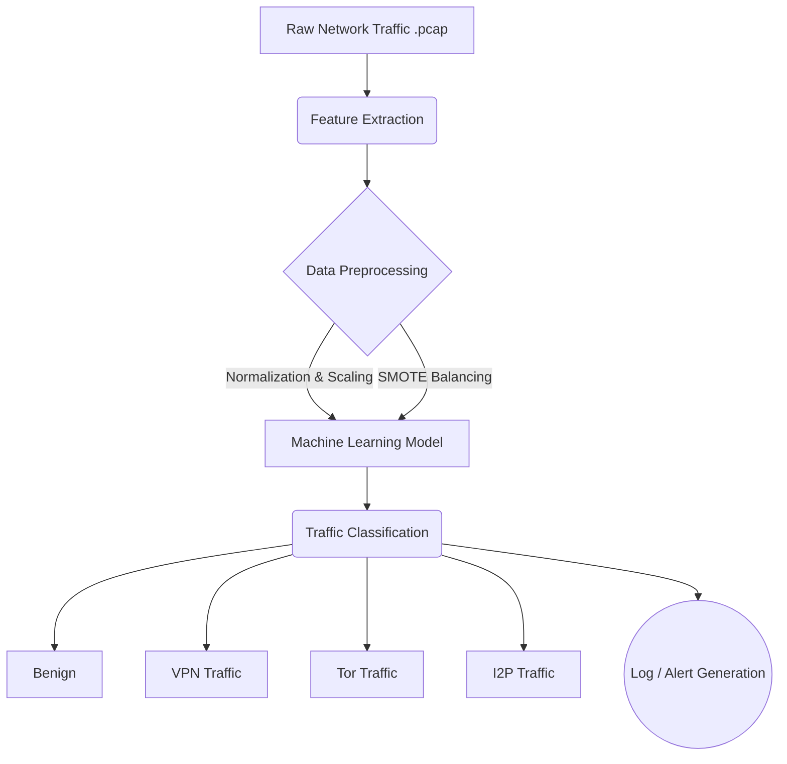

# 🕵️‍♂️ Darknet Detection Framework

[](https://opensource.org/licenses/MIT)
[](https://www.python.org/downloads/)
[](https://www.docker.com/)
[](https://github.com/hritwig/darknet-detection/graphs/commit-activity)
[](http://makeapullrequest.com)

> An end-to-end Machine Learning pipeline designed to detect, classify, and analyze Darknet traffic (Tor, I2P, VPNs) to enhance network security and threat intelligence.

---

## 📖 Table of Contents
- [About The Project](#-about-the-project)
  - [The Problem](#the-problem)
  - [The Solution](#the-solution)
- [Key Features](#-key-features)
- [System Architecture](#-system-architecture)
- [Project Structure](#-project-structure)
- [Getting Started](#-getting-started)
  - [Prerequisites](#prerequisites)
  - [Standard Installation](#standard-installation)
  - [Docker Installation](#docker-installation)
- [Usage](#-usage)
  - [Command Line Interface (CLI)](#1-command-line-interface-cli)
  - [REST API Server](#2-rest-api-server)
- [Model Evaluation & Metrics](#-model-evaluation--metrics)
- [Roadmap](#-roadmap)
- [Contributing](#-contributing)
- [Acknowledgments](#-acknowledgments)
- [License](#-license)

---

## 🧠 About The Project

### The Problem
The anonymity provided by overlay networks like Tor, I2P, and VPNs serves a dual purpose. While it protects the privacy of journalists and activists, it is heavily exploited by malicious actors for illegal activities, botnet command-and-control (C2), and data exfiltration. Traditional port-based or Deep Packet Inspection (DPI) firewalls struggle to detect this heavily encrypted traffic.

### The Solution
**Darknet-Detection** leverages advanced flow-based feature extraction and ensemble machine learning algorithms to analyze statistical network behaviors (e.g., packet inter-arrival times, flow duration, byte distributions). By learning these behavioral patterns, the model can accurately classify traffic into **Benign, VPN, Tor, and I2P** categories without needing to decrypt the payload.

---

## ✨ Key Features
* **Multi-Class Classification:** Differentiates between Normal, VPN, Tor, and I2P traffic.
* **Automated Feature Engineering:** Converts raw `.pcap` files into statistical flow features (compatible with CICFlowMeter).
* **Highly Optimized ML Pipeline:** Built-in data preprocessing, SMOTE class balancing, and hyperparameter tuning.
* **REST API Support:** Includes a lightweight FastAPI/Flask wrapper for real-time inference and third-party integration.
* **Containerized:** Fully Dockerized for seamless deployment across different environments.

---

## 🏗 System Architecture



---

## 📂 Project Structure

```text
darknet-detection/
├── data/
│   ├── raw/                  # Raw PCAP files or CSV datasets
│   └── processed/            # Cleaned, ready-to-train datasets
├── models/                   # Saved model binaries (.pkl, .h5)
├── notebooks/                # Jupyter notebooks for EDA and prototyping
├── src/                      # Source code for the pipeline
│   ├── __init__.py
│   ├── extract_features.py   # Scripts to parse PCAPs
│   ├── preprocess.py         # Data cleaning and scaling
│   ├── train.py              # Model training scripts
│   └── evaluate.py           # Model testing and metric generation
├── api/                      # REST API for model inference
│   └── app.py
├── configs/                  # Configuration files (YAML/JSON)
├── tests/                    # Unit tests for functions
├── Dockerfile                # Docker container configuration
├── requirements.txt          # Python dependencies
└── README.md                 # You are here
```

---

## 🚀 Getting Started

### Prerequisites
* Python 3.8 or higher
* [Wireshark / TShark](https://www.wireshark.org/) (for packet capture extraction)
* *Optional:* Docker

### Standard Installation

1. **Clone the repository:**
   ```bash
   git clone [https://github.com/hritwig/darknet-detection.git](https://github.com/hritwig/darknet-detection.git)
   cd darknet-detection
   ```

2. **Set up a virtual environment:**
   ```bash
   python -m venv venv
   source venv/bin/activate  # On Windows: venv\Scripts\activate
   ```

3. **Install dependencies:**
   ```bash
   pip install -r requirements.txt
   ```

### Docker Installation
If you prefer not to install dependencies on your local machine, you can run the project via Docker:
```bash
docker build -t darknet-detection .
docker run -p 8000:8000 darknet-detection
```

---

## 💻 Usage

### 1. Command Line Interface (CLI)

**Data Preprocessing:**
```bash
python src/preprocess.py --input data/raw/dataset.csv --output data/processed/cleaned.csv
```

**Train the Model:**
```bash
python src/train.py --data data/processed/cleaned.csv --model xgboost --save models/xgb_v1.pkl
```

**Run Inference on a PCAP file:**
```bash
python src/evaluate.py --file data/suspicious_traffic.pcap --model models/xgb_v1.pkl
```

### 2. REST API Server
You can spin up a local API server to send network flows to the model via HTTP POST requests.

```bash
# Start the API server
uvicorn api.app:app --host 0.0.0.0 --port 8000
```
*Send a POST request with traffic features to `http://localhost:8000/predict` to get a JSON response with the classification.*

---

## 📊 Model Evaluation & Metrics

We benchmarked several models on the **CIC-Darknet2020 Dataset**. 

| Model | Accuracy | Precision | Recall | F1-Score | Training Time |
| :--- | :---: | :---: | :---: | :---: | :---: |
| Random Forest | 98.2% | 0.981 | 0.982 | 0.981 | ~45 sec |
| **XGBoost** | **99.1%** | **0.990** | **0.991** | **0.990** | **~20 sec** |
| Deep Neural Net | 97.5% | 0.974 | 0.975 | 0.974 | ~5 mins |

* **Feature Importance:** Time-based features (e.g., `Flow Duration`, `Active Mean`) and Packet-Length distributions proved to be the strongest predictors of Darknet traffic.

---

## 🗺 Roadmap

- [x] Initial data exploration and preprocessing.
- [x] Train baseline Random Forest and XGBoost models.
- [ ] Implement live packet capture and real-time prediction pipeline.
- [ ] Add deep learning models (LSTM, 1D-CNN) for sequence analysis.
- [ ] Build a web dashboard for traffic visualization.

---

## 🤝 Contributing
Contributions are what make the open-source community such an amazing place to learn, inspire, and create. Any contributions you make are **greatly appreciated**.

1. Fork the Project
2. Create your Feature Branch (`git checkout -b feature/AmazingFeature`)
3. Commit your Changes (`git commit -m 'Add some AmazingFeature'`)
4. Push to the Branch (`git push origin feature/AmazingFeature`)
5. Open a Pull Request

---

## 🏆 Acknowledgments
* [Canadian Institute for Cybersecurity (CIC)](https://www.unb.ca/cic/datasets/index.html) for providing the open-source darknet datasets.
* The open-source network analysis community.

---

## 📄 License
Distributed under the MIT License. See `LICENSE` for more information.

---
*Developed by [hritwig](https://github.com/hritwig) | [Report a Bug](https://github.com/hritwig/darknet-detection/issues)*
